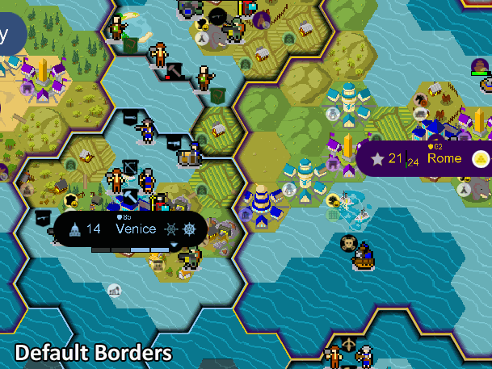
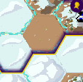
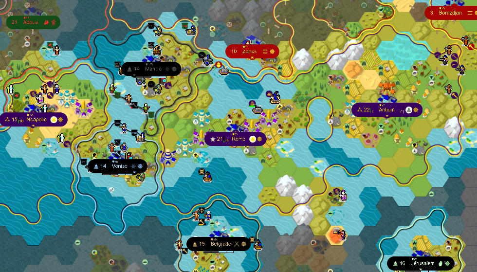

# Thin Bubbly Borders

Latest version: June 12th, 2022

Original Bubbly Borders mod creator: [will-ca](https://github.com/will-ca/Bubbly-Borders-Example)

---
Compared to default borders, Thin Bubbly Borders makes:

- Easier to see "clash" points between civ territories
- Easier to see unowned tiles inside or between civ territories
- Easier to see roads crossing two borders
- Easier to see rivers being on the same tile edge than a border
- Easier to see all territories global shapes when zooming out

 

---
Changes:

- Outer border thickness = -4px
- Inner border thickness = -4px
- Inner border offset = -3,2px
- Inner border blur = -50%

---
Installation:

1. If the original "Bubbly Borders Example" mod is already installed, untick "Permanent audiovisual mod" for it.
2. Install Thin Bubbly Borders, and tick "Permanent audiovisual mod" for it.
3. The tileset borders still appear as "Bubbly Borders" in the Display option menu.
4. Select it, then select the tileset of your choice (HexaRealm, FantasyHex, etc.)

This work is licensed under CC-BY-4.0.

---

#### Border Examples Set by will-ca:

* [**Sleek**](https://github.com/will-ca/Sleek-Borders-Example)
* [**Bubbly**](https://github.com/will-ca/Bubbly-Borders-Example)
* [**Greasy**](https://github.com/will-ca/Greasy-Borders-Example)
* [**Sketchy**](https://github.com/will-ca/Sketchy-Borders-Example)
